# ERD — Kasirku POS Platform v1.0

> Render diagram ini di: **VS Code** (extension: Mermaid Preview) atau **https://mermaid.live**

```mermaid
erDiagram

%% ============================================================
%% PLATFORM LAYER
%% ============================================================

    TENANTS {
        string  id              PK
        string  name
        string  slug            UK "subdomain"
        string  email           UK
        string  plan            "FREE|STARTER|GROWTH|ENTERPRISE"
        string  status          "ACTIVE|SUSPENDED|TRIAL|CANCELLED"
        int     maxOutlets
        int     maxStaff
        datetime trialEndsAt
        datetime createdAt
        datetime updatedAt
    }

    SUBSCRIPTIONS {
        string  id              PK
        string  tenantId        FK
        string  plan
        decimal amount
        boolean isPaid
        datetime startDate
        datetime endDate
        datetime paidAt
        string  invoiceRef
        datetime createdAt
    }

%% ============================================================
%% USER & AUTH
%% ============================================================

    USERS {
        string  id              PK
        string  tenantId        FK  "null = Super Admin"
        string  name
        string  email           UK
        string  passwordHash
        string  pin             "hashed 6-digit PIN"
        string  role            "SUPER_ADMIN|TENANT_OWNER|STORE_MANAGER|CASHIER"
        string  status          "ACTIVE|INACTIVE|LOCKED"
        datetime lastLoginAt
        datetime createdAt
        datetime updatedAt
    }

    USER_OUTLET_ROLES {
        string  id              PK
        string  userId          FK
        string  outletId        FK
        string  tenantId        "denormalized"
        string  role            "role override per outlet"
    }

    REFRESH_TOKENS {
        string  id              PK
        string  userId          FK
        string  tokenHash       UK
        string  deviceInfo
        string  ipAddress
        datetime expiresAt
        datetime revokedAt
        datetime createdAt
    }

%% ============================================================
%% OUTLET
%% ============================================================

    OUTLETS {
        string  id              PK
        string  tenantId        FK
        string  name
        string  address
        string  city
        boolean isActive
        string  timezone
        decimal taxRate         "e.g. 0.1100 = 11%"
        string  receiptNote
        datetime createdAt
        datetime updatedAt
    }

%% ============================================================
%% PRODUCT CATALOG
%% ============================================================

    CATEGORIES {
        string  id              PK
        string  tenantId        FK
        string  name
        string  color           "hex color"
        int     sortOrder
        boolean isActive
        datetime createdAt
        datetime updatedAt
    }

    PRODUCTS {
        string  id              PK
        string  tenantId        FK
        string  categoryId      FK
        string  name
        string  sku             UK "unique per tenant"
        string  barcode
        string  unit            "pcs|kg|liter"
        string  status          "ACTIVE|INACTIVE|DELETED"
        boolean hasVariants
        datetime createdAt
        datetime updatedAt
    }

    PRODUCT_VARIANTS {
        string  id              PK
        string  productId       FK
        string  tenantId        "denormalized"
        string  name            "e.g. Ukuran: L"
        string  sku             UK "unique per tenant"
        string  barcode
        string  status
        datetime createdAt
        datetime updatedAt
    }

    OUTLET_PRICES {
        string  id              PK
        string  tenantId        "denormalized"
        string  outletId        FK
        string  productId       FK
        string  variantId       FK  "nullable"
        decimal costPrice       "HPP / Harga Modal"
        decimal sellPrice       "Harga Jual"
        datetime updatedAt
    }

%% ============================================================
%% INVENTORY
%% ============================================================

    INVENTORIES {
        string  id              PK
        string  tenantId        "denormalized"
        string  outletId        FK
        string  productId       FK
        string  variantId       FK  "nullable"
        decimal quantity        "Decimal(12,3)"
        decimal minStock        "alert threshold"
        datetime updatedAt
    }

    STOCK_MUTATIONS {
        string  id              PK
        string  tenantId        "denormalized"
        string  outletId
        string  productId
        string  variantId       "nullable"
        string  type            "PURCHASE|SALE|ADJUSTMENT|TRANSFER_OUT|TRANSFER_IN|RETURN|DAMAGE"
        decimal quantityBefore
        decimal quantityChange  "positif=masuk, negatif=keluar"
        decimal quantityAfter
        string  referenceId     "FK ke transaksi/transfer/adjustment"
        string  referenceType   "TRANSACTION|TRANSFER|ADJUSTMENT"
        string  note
        datetime createdAt      "immutable log"
    }

    STOCK_ADJUSTMENTS {
        string  id              PK
        string  tenantId        "denormalized"
        string  outletId        FK
        string  userId          FK  "siapa yang melakukan"
        string  note
        datetime createdAt
    }

    STOCK_ADJUSTMENT_ITEMS {
        string  id              PK
        string  adjustmentId    FK
        string  productId
        string  variantId       "nullable"
        decimal systemQuantity  "stok di sistem sebelum opname"
        decimal actualQuantity  "hasil hitung fisik"
        decimal difference      "actual - system"
    }

    STOCK_TRANSFERS {
        string  id              PK
        string  tenantId        "denormalized"
        string  fromOutletId    FK
        string  toOutletId      FK
        string  requestedById   FK
        string  approvedById    FK  "nullable"
        string  status          "PENDING|APPROVED|REJECTED|CANCELLED"
        string  note
        datetime requestedAt
        datetime processedAt    "nullable"
    }

    STOCK_TRANSFER_ITEMS {
        string  id              PK
        string  transferId      FK
        string  productId
        string  variantId       "nullable"
        decimal quantity
    }

%% ============================================================
%% SHIFT
%% ============================================================

    SHIFTS {
        string  id              PK
        string  tenantId        "denormalized"
        string  outletId        FK
        string  openedById      FK
        string  closedById      FK  "nullable"
        string  status          "OPEN|CLOSED"
        decimal openingCash     "saldo kas awal"
        decimal closingCash     "saldo kas akhir (fisik)"
        decimal expectedCash    "saldo kalkulasi sistem"
        decimal cashDifference  "closing - expected"
        datetime openedAt
        datetime closedAt       "nullable"
        string  notes
    }

%% ============================================================
%% DISCOUNT
%% ============================================================

    DISCOUNTS {
        string  id              PK
        string  tenantId        FK
        string  name
        string  type            "PERCENTAGE|FIXED_AMOUNT"
        decimal value
        decimal minPurchase     "nullable"
        decimal maxDiscount     "nullable, batas nominal untuk tipe %"
        boolean isActive
        datetime startsAt       "nullable"
        datetime endsAt         "nullable"
        datetime createdAt
        datetime updatedAt
    }

%% ============================================================
%% TRANSACTION (POS)
%% ============================================================

    TRANSACTIONS {
        string  id                      PK
        string  tenantId                "denormalized"
        string  outletId                FK
        string  shiftId                 FK
        string  cashierId               FK
        string  receiptNumber           UK "per outlet"
        string  status                  "COMPLETED|VOIDED|REFUNDED|PARTIAL_REFUND"
        decimal subtotal
        string  discountId              FK  "nullable"
        decimal discountAmount
        decimal taxAmount
        decimal totalAmount
        string  paymentMethod           "CASH|DEBIT_CARD|CREDIT_CARD|QRIS|TRANSFER|OTHER"
        decimal amountPaid
        decimal changeAmount
        string  voidReason              "nullable"
        string  voidAuthorizedById      FK  "nullable, Manager PIN"
        string  originalTransactionId   "nullable, untuk refund"
        datetime voidedAt               "nullable"
        datetime createdAt
    }

    TRANSACTION_ITEMS {
        string  id              PK
        string  transactionId   FK
        string  productId       FK
        string  variantId       FK  "nullable"
        string  productName     "SNAPSHOT saat transaksi"
        string  variantName     "SNAPSHOT nullable"
        string  sku             "SNAPSHOT"
        decimal quantity
        decimal unitPrice       "SNAPSHOT harga jual"
        decimal costPrice       "SNAPSHOT HPP untuk laba"
        decimal discountAmount
        decimal subtotal
    }

%% ============================================================
%% AUDIT
%% ============================================================

    AUDIT_LOGS {
        string  id              PK
        string  tenantId        "nullable"
        string  userId          "nullable"
        string  action          "e.g. VOID_TRANSACTION"
        string  resource        "e.g. Transaction"
        string  resourceId
        json    oldValue
        json    newValue
        string  ipAddress
        string  userAgent
        datetime createdAt      "immutable"
    }

%% ============================================================
%% RELATIONSHIPS
%% ============================================================

    TENANTS ||--o{ SUBSCRIPTIONS       : "memiliki"
    TENANTS ||--o{ USERS               : "memiliki"
    TENANTS ||--o{ OUTLETS             : "memiliki"
    TENANTS ||--o{ CATEGORIES          : "memiliki"
    TENANTS ||--o{ PRODUCTS            : "memiliki"
    TENANTS ||--o{ DISCOUNTS           : "memiliki"

    USERS   ||--o{ USER_OUTLET_ROLES   : "memiliki role di"
    USERS   ||--o{ REFRESH_TOKENS      : "memiliki"
    USERS   ||--o{ SHIFTS              : "membuka (openedById)"
    USERS   |o--o{ SHIFTS              : "menutup (closedById)"
    USERS   ||--o{ TRANSACTIONS        : "sebagai kasir"
    USERS   |o--o{ TRANSACTIONS        : "otorisasi void"
    USERS   ||--o{ STOCK_ADJUSTMENTS   : "melakukan"
    USERS   ||--o{ STOCK_TRANSFERS     : "mengajukan (requestedById)"
    USERS   |o--o{ STOCK_TRANSFERS     : "menyetujui (approvedById)"

    OUTLETS ||--o{ USER_OUTLET_ROLES   : "memiliki role mapping"
    OUTLETS ||--o{ INVENTORIES         : "menyimpan stok"
    OUTLETS ||--o{ OUTLET_PRICES       : "memiliki harga"
    OUTLETS ||--o{ SHIFTS              : "menjalankan shift"
    OUTLETS ||--o{ TRANSACTIONS        : "tempat transaksi"
    OUTLETS ||--o{ STOCK_ADJUSTMENTS   : "tempat opname"
    OUTLETS ||--o{ STOCK_TRANSFERS     : "asal transfer (fromOutletId)"
    OUTLETS ||--o{ STOCK_TRANSFERS     : "tujuan transfer (toOutletId)"

    CATEGORIES ||--o{ PRODUCTS         : "mengelompokkan"

    PRODUCTS   ||--o{ PRODUCT_VARIANTS  : "memiliki varian"
    PRODUCTS   ||--o{ INVENTORIES       : "dipantau stoknya"
    PRODUCTS   ||--o{ OUTLET_PRICES     : "memiliki harga per outlet"
    PRODUCTS   ||--o{ TRANSACTION_ITEMS : "dicatat di transaksi"

    PRODUCT_VARIANTS ||--o{ INVENTORIES       : "stok varian"
    PRODUCT_VARIANTS ||--o{ OUTLET_PRICES     : "harga varian"
    PRODUCT_VARIANTS ||--o{ TRANSACTION_ITEMS : "item varian"

    SHIFTS       ||--o{ TRANSACTIONS          : "menampung transaksi"

    DISCOUNTS    |o--o{ TRANSACTIONS          : "dipakai di"

    TRANSACTIONS ||--o{ TRANSACTION_ITEMS     : "terdiri dari"

    STOCK_ADJUSTMENTS   ||--o{ STOCK_ADJUSTMENT_ITEMS : "terdiri dari"
    STOCK_TRANSFERS     ||--o{ STOCK_TRANSFER_ITEMS   : "terdiri dari"
```



---

## Ringkasan Domain & Relasi

### Layer Isolasi Tenant
Semua tabel operasional membawa kolom `tenant_id`. Tabel yang di-denormalize (tidak punya FK eksplisit ke `tenants`) tetap menyimpan `tenant_id` sebagai kolom string untuk efisiensi query filter tanpa JOIN tambahan.

### Alur Data Utama

```
TENANT
  └── OUTLET (1..N)
        ├── USER_OUTLET_ROLE  ← siapa bisa apa di outlet ini
        ├── OUTLET_PRICE      ← harga jual & HPP per produk
        ├── INVENTORY         ← stok aktual
        ├── SHIFT
        │     └── TRANSACTION
        │           └── TRANSACTION_ITEM  ← snapshot nama & harga
        └── STOCK_ADJUSTMENT
              └── STOCK_ADJUSTMENT_ITEM

PRODUCT (master tenant)
  ├── PRODUCT_VARIANT
  ├── OUTLET_PRICE     (per outlet)
  └── INVENTORY        (per outlet)

STOCK_TRANSFER (antar outlet)
  └── STOCK_TRANSFER_ITEM

STOCK_MUTATION  ← immutable audit trail semua perubahan stok
AUDIT_LOG       ← immutable log aksi sensitif
```

### Keputusan Desain Penting

| Tabel | Keputusan | Alasan |
|---|---|---|
| `TRANSACTION_ITEMS` | Simpan snapshot `productName`, `sku`, `unitPrice`, `costPrice` | Produk bisa diubah/dihapus setelah transaksi terjadi |
| `STOCK_MUTATIONS` | Tidak ada FK eksplisit, hanya `referenceId` + `referenceType` | Polimorfik — satu tabel log untuk semua sumber perubahan stok |
| `USER_OUTLET_ROLES` | Unique constraint `[userId, outletId]` | 1 user hanya boleh punya 1 role per outlet |
| `OUTLET_PRICES` | `variantId` nullable dalam composite unique | Mendukung produk tanpa varian dan produk dengan varian dalam satu tabel |
| `SHIFTS` | Simpan `expectedCash` dan `cashDifference` | Rekonsiliasi kas otomatis, deteksi selisih tanpa kalkulasi ulang |
